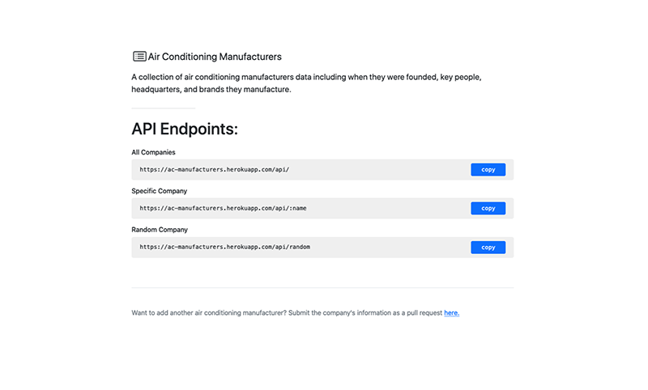

<div align="center">
  <h3 align="center">Air Conditioning Manufacturers API</h3>
  <p align="center">
    An API with information on some of the biggest air conditioning companies.
  </p>
  
</div>

## How It's Made:
Stored large air conditioning manufacturers' data (brands, year founded, headquarters, key people, and website). Added two endpoints for quickly accessing the information of all companies or a single company.
### Tech Used:
[![JS][Javascript]][Javascript]

<!-- GETTING STARTED -->
## Installation

2. Install NPM packages
   ```sh
   npm install
   ```
3. Start the development server
   ```sh
   npm run dev
   ```
4. Access server at [https://localhost:8000](https://localhost:8000)

## Endpoints

All Companies - [https://ac-manufacturers.herokuapp.com/api/](https://ac-manufacturers.herokuapp.com/api/)

Specific Company - [https://ac-manufacturers.herokuapp.com/api/rheem](https://ac-manufacturers.herokuapp.com/api/rheem)

## Optimizations

Added the ability to display all companies with one request. Endpoint for specific company works regardless of capitalization in paremeters. 

## Lessons Learned:

Finding correct, up-to-date information on some smaller air conditioning brands can be cumbersome due to their lack of online presence. I found their information by searching through news websites and brand trademarks. An API is a great way to keep content related to a specific topic in one place, making it easier for those researching the topic to get the information they need.

<!-- MARKDOWN LINKS & IMAGES -->
[Javascript]: https://img.shields.io/badge/javascript%20-%23323330.svg?&style=for-the-badge&logo=javascript&logoColor=%23F7DF1E
[screenshot]: screenshot.png